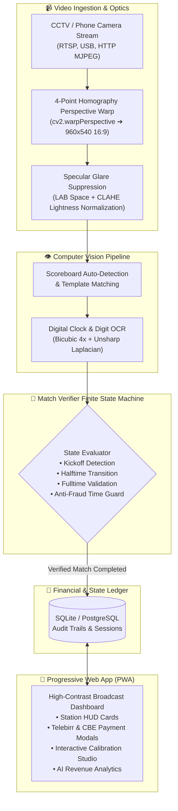

<div align="center">

# 🎮 GAMEWATCH™
### *A TSEGA Labs product*
#### *AI-Powered Gaming Lounge Automation, Match Verification & Anti-Fraud Financial System*

[](https://python.org)
[](https://opencv.org)
[](https://flask.palletsprojects.com/)
[](https://web.dev/progressive-web-apps/)
[](#-dual-payment-gateways--financial-auditing)
[](LICENSE)

<br/>

> **"Transform ordinary gaming lounges into automated, leak-proof smart esports centers."**  
> GameWatch turns any low-cost security camera or Android phone into an automated referee and financial cashier for EA Sports FC™ and eFootball™ gaming lounges.

---

</div>

## 🌟 Executive Overview

In gaming lounges across East Africa (Addis Ababa, Hawassa, Adama, etc.), video gaming—especially **EA Sports FC (FIFA)** and **eFootball (PES)** on PS4 and PS5—is a booming commercial business. Gamers pay per 10-minute match or by hourly blocks.

However, lounge owners face a critical dilemma:
* **The Revenue Leak**: Station clerks frequently allow friends to play off-the-record, pocket cash directly, or miscount completed matches. Revenue loss often exceeds **35% to 40%**.
* **The Hardware Hurdle**: Professional HDMI splitters, video capture cards, and PC server racks cost thousands of dollars—unaffordable for typical local operators.
* **The Camera Angle Reality**: Lounges mount low-cost security cameras or phones high up on ceilings or walls (30°–60° angles). Physical TVs appear distorted, keystoned, and washed out by fluorescent lighting.

### 💡 The GameWatch Solution
**GameWatch** uses computer vision and time-aware finite state machines to watch TV screens from angled cameras. It tracks kickoff, half-time, full-time, and penalties automatically, logs every match to a tamper-proof database, collects payments via **Telebirr** and **Commercial Bank of Ethiopia (CBE Birr)**, and provides real-time revenue analytics to the lounge owner's smartphone.

---

## 🏛️ System Architecture



---

## ⚡ Core Features

### 1. 🛡️ Angled CCTV & Phone Keystoning (Step 1 Hardened)
* **4-Point Homography Warp**: Drag 4 magnetic corner pins (`Top-Left`, `Top-Right`, `Bottom-Right`, `Bottom-Left`) over any angled or tilted TV screen. GameWatch flattens keystoned angles (up to 60°) into a canonical 16:9 ($960 \times 540$) virtual screen.
* **Deterministic Clockwise Point Ordering**: Eliminates twisted or inverted geometry automatically.
* **CLAHE Anti-Glare Suppression**: Equalizes harsh ceiling fluorescent tube reflections and glare hotspots in LAB color space without mutating EA FC team colors.
* **Angle Presets**: One-click quick presets: `Flat (0°)`, `Ceiling 45°`, `Left 35°`, `Right 35°`.

### 2. ⏱️ Anti-Fraud Match Verifier Brain
* **Clock Continuity & Verification**: Tracks match time monotonically from minute `00:00` through `90:00+`. Rejects video freezes, paused menus, and camera obstruction.
* **Match Lifecycle FSM**:
  - `WAITING` ➔ Console idle or menu screen.
  - `FIRST_HALF` ➔ Active gameplay clock running.
  - `HALF_TIME` ➔ Paused intermission at 45'.
  - `SECOND_HALF` ➔ Gameplay resumed from 45' to 90'.
  - `MATCH_OVER` ➔ Whistle blown; increments session match counter by 1.
* **Tamper-Proof Audit Logging**: If a clerk manually deducts a game (`-1`), an irreversible audit record is logged with clerk name, timestamp, and mandatory cancellation reason.

### 3. 💳 Dual Payment Gateways (Telebirr & CBE Birr)
* **Telebirr SuperApp**: Dynamic QR generation with custom lounge account number, recipient name, and exact Birr amount.
* **Commercial Bank of Ethiopia (CBE Birr)**: Support for CBE accounts, direct mobile transfers, and transaction reference verification.
* **Instant Checkout & Receipts**: Calculates total bill, discounts, and payment methods with digital invoice generation.

### 4. 🏆 Tournaments & Community Events Engine
* **Owner Event Management**: Create gaming tournaments directly from the dashboard (e.g., *4 Kilo EA FC 25 Showdown*).
* **Participant Registration**: Track entrants, seed player brackets, configure entry fees, and view real-time attendee lists.

### 5. 📊 Business Intelligence & AI Peak Analytics
* **Revenue Metrics**: Real-time daily, weekly, and monthly gross revenue.
* **Occupancy Intelligence**: Identifies busiest lounge peak hours (e.g., 8:00 PM – 11:00 PM) and TV utilization rates.
* **AI Growth Insights**: Smart suggestions on pricing, off-peak promotions, and controller maintenance.

### 6. 🎨 Dual-Theme Design System
* **Obsidian Dark Mode**: Deep black (`#0a0d14`) and midnight slate (`#121622`) with cyber-emerald accents (`#00f59b`). Tailored for dimmed lounge night shifts.
* **Crisp Daylight Light Mode**: WCAG AAA compliant slate (`#f8fafc`) with bold typography (`#0f172a`). 100% readable under outdoor sunlight and bright kiosks.
* **Mobile & Tablet Ready**: Responsive flex/grid architecture with touch-friendly handles and zero horizontal edge clipping.

---

## 🚀 Quick Start Guide

### Prerequisites
* **Python 3.10+** installed
* **Git** installed
* A webcam, USB camera, RTSP IP camera, or Android phone running IP Webcam / DroidCam

### 1. Clone the Repository
```bash
git clone https://github.com/Abyman2/Gamewatch.git
cd Gamewatch
```

### 2. Set Up Virtual Environment
```bash
# Windows
python -m venv venv
.\venv\Scripts\activate

# Linux / macOS
python3 -m venv venv
source venv/bin/activate
```

### 3. Install Dependencies
```bash
pip install -r requirements.txt
```

### 4. Launch the GameWatch Server
```bash
python app_server.py
```
The server will boot on `http://127.0.0.1:5000` (or your local network IP `http://192.168.x.x:5000`).

### 5. Open in Browser / Mobile PWA
Navigate to:
```
http://localhost:5000
```

#### Default Credentials:
* **Owner Account**: `abyman24680@gmail.com`
* **Password**: `password123`
* **Lounge Code**: `GW-OWNER-050`

---

## 📺 TV Setup & Camera Calibration Guide

Setting up your cameras in a real lounge takes under 2 minutes:

1. **Mount Camera**: Mount your camera or smartphone overlooking the TV stations (even at a steep 45° angle from the ceiling).
2. **Open TV Setup**: Log in as Owner and click **Setup** in the top navigation.
3. **Select TV Station**: Choose **TV 1**, **TV 2**, or **+ Add New Station**.
4. **Choose Keystone Mode**: Ensure `⬡ 4-Point Keystone` mode is active.
5. **Drag Pins**: Drag the 4 corner handles (`TL`, `TR`, `BR`, `BL`) to match the 4 physical corners of the TV screen on the canvas.
   * *Tip*: Or click one of the quick presets like **Ceiling 45°** or **Left 35°**.
6. **Anti-Glare**: Toggle **☀ Anti-Glare Filter** if ceiling lights reflect on the screen.
7. **Analyze & Save**: Click **Analyze Screen** to preview the rectified 16:9 feed, then click **Save Configuration**.

---

## 🧪 Running the Automated Verification Suite

GameWatch includes an end-to-end regression and computer vision test suite:

### 1. Run Complete Step 1 Hardening Test
Tests quad perspective math, CLAHE glare removal, live API rectification, and TV state persistence:
```bash
python scratch/test_step1_complete.py
```
*Expected Output:*
```text
============================================================
STEP 1 HARDENING: COMPUTER VISION PIPELINE & CALIBRATION TEST
============================================================
[PASS] 1. Quad point ordering verified (deterministic clockwise order)
[PASS] 2. Keystone angles estimated: Pitch: 0.8°, Yaw: 22.1°, Composite Tilt: 22.1°
[PASS] 3. Homography perspective rectification produced exact 960x540 canonical feed
[PASS] 4. CLAHE Specular glare suppression executed cleanly
[PASS] 5. Authenticated with app_server API
[PASS] 6. Auto-detect endpoint returned screens with 4 corner vertices
[PASS] 7. /api/tv/analyze_crop successfully rectified quad with tilt: 5.4°
[PASS] 8. /api/tv/save persisted 4-point corners and anti-glare toggle
[PASS] 9. /api/state confirms TV 1 is running 4-point homography & anti-glare in production
============================================================
ALL STEP 1 HARDENING CRITERIA VERIFIED AND PASSING 100%!
============================================================
```

### 2. Run Full System Operations Suite
Tests lounge codes, geolocation search, tournament registration, deduct game audit, and analytics:
```bash
python scratch/test_verification_all.py
```

### 3. Validate JavaScript Syntax
```bash
node -c static/js/app.js
```

---

## 📂 Repository Structure

```text
GameWatch/
├── app_server.py                 # Core Flask backend, WebTVChannel threads & API routes
├── scoreboard_preprocessor.py    # 4-point homography, glare suppression & CLAHE filters
├── scoreboard_reader.py          # Scoreboard bounding box locator & digit OCR engine
├── match_verifier.py             # Time-aware finite state machine match verification
├── db_manager.py                 # SQLite database engine, sessions, audit log & analytics
├── tv_regions.json               # Persisted TV coordinates, keystone corners & anti-glare toggles
├── lounge_settings.json          # Lounge pricing, Telebirr & CBE merchant credentials
├── templates/
│   └── index.html                # Unified PWA template with stations HUD & TV Studio
├── static/
│   ├── css/
│   │   └── style.css             # Obsidian & Light theme design system (WCAG AAA)
│   ├── js/
│   │   ├── app.js                # Interactive canvas, drag pins, and real-time state sync
│   │   └── sw.js                 # Service Worker for offline PWA operation
│   └── icons/                    # App icons, favicons & manifest assets
├── scoreboard_templates/         # EA FC / eFootball score badge templates
├── digit_templates/              # High-contrast 0-9 digit template matching database
├── PROGRESS.md                   # Single source of truth progress & decision ledger
├── requirements.txt              # Production Python package dependencies
└── scratch/                      # Automated test scripts & verification suites
```

---

## 🗺️ Operational Roadmap

| Step | Objective | Status | Description |
| :---: | :--- | :---: | :--- |
| **Step 1** | **Angled CCTV & Phone Hardening** | ✅ **COMPLETED** | 4-point perspective warp, glare suppression, interactive calibration UI. |
| **Step 2** | **Zero-Cost Cloud Deployment** | ⏳ **NEXT** | Cloudflare Pages (Frontend) + Render/Koyeb (Backend) + Neon DB ($0/mo). |
| **Step 3** | **Android Capacitor 6 Packaging** | 📋 **PLANNED** | Native `.apk` / `.aab`, CameraX integration, Google Play Store launch. |

---

## 📄 License & Credits

* **Product**: **GameWatch — A TSEGA Labs product**
* **Organization**: **TSEGA Labs**
* **Lead Creator**: Abel Seleshi ([@Abyman2](https://github.com/Abyman2))
* **Copyright**: © 2026 TSEGA Labs. All rights reserved.
* **License**: Released under the **MIT License**. See [LICENSE](LICENSE) for details.
* **Built For**: Gaming lounge owners and esports communities across Ethiopia & worldwide.

---

<div align="center">
  <sub>GameWatch — A TSEGA Labs product · Built with ❤️ for gaming lounge owners in Ethiopia & worldwide.</sub><br/>
  <sub>© 2026 TSEGA Labs. All rights reserved.</sub>
</div>
